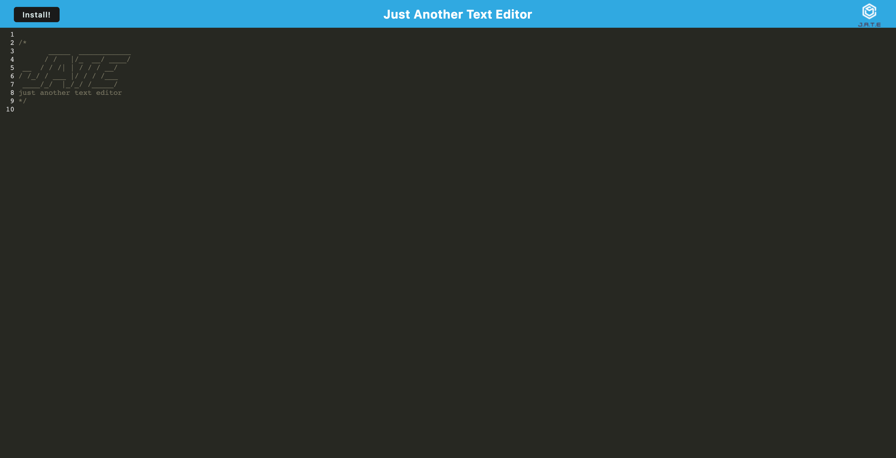

# # PWA-TextEditor 

## Table of Contents:

- [Description](./README.md#description)
- [License](./README.md#license)
- [Contributing](./README.md#contributing)
- [Screenshot](./README.md#screenshot)
- [Links to Application](./README.md#links-to-application)
- [Questions](./README.md#questions)

## Description

This is a PWA Text editor that allows a user to use the text editor in the browser. They can also download it and use it on their machine as a application. it uses indexedDB and cache storage as a database to save their text and does not need internet to be used.

## License

This software is licensed to MIT, for more information you may visit this link:
[MIT License Wikipedia](https://en.wikipedia.org/wiki/MIT_License)

## Contributing

If you wish to contribute to our content, please contact one of us at:

- smarr2198@gmail.com

## Screenshot

## Links to Application

- Here is the link to the repo: [smarr2198/repo](https://github.com/smarr2198/PWA-TextEditor)
- Here is the link to the Heroku URL: [smarr2198/pages](https://pwa-text-editor-smarr2198.herokuapp.com/)

## Questions

If you have any questions, you may contact:

#### Stephen Marr

- Email: smarr2198@gmail.com
- Github Profile: [https://www.github.com/smarr2198](https://www.github.com/smarr2198)
